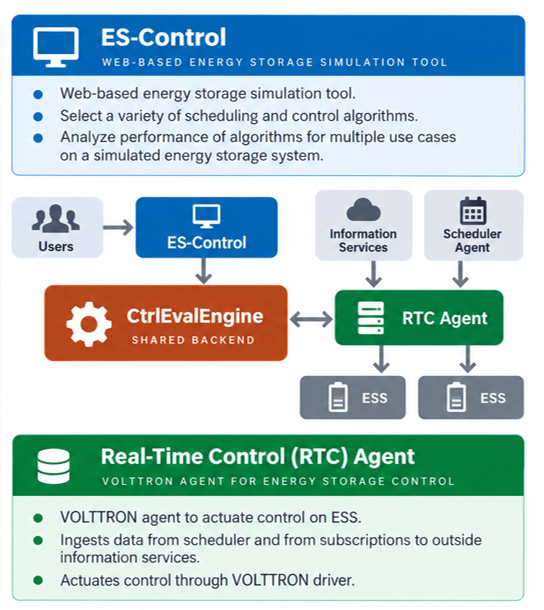

# ES Control Integration

[Control Evaluation Engine](https://github.com/der-control-modules/ctrl-eval-engine){ .md-button }
[ES-Control Web Tool](https://es-control.pnnl.gov/){ .md-button }

[ES-Control](https://es-control.pnnl.gov/) is PNNL's web-based energy storage simulation tool. Users select
scheduling and real-time control algorithms, define use cases, and analyze the performance of the algorithms on a
simulated energy storage system. Its backend, the **Control Evaluation Engine**, is also the backend of the
[Real-Time Control Agent](rt-control.md), so an algorithm evaluated in ES-Control can be actuated on real hardware
without re-implementation, and simulated performance can be compared directly against real-world operation, as shown
in [](#ctrl-eval-engine-architecture).

Figure: ES-Control and the Real-Time Control Agent share the Control Evaluation Engine as a common backend.
{#ctrl-eval-engine-architecture}



## Control Evaluation Engine

The Control Evaluation Engine is written primarily in Julia, with some Python components. It is summarized in
[](#control-eval-engine) and consists of four modules:

| Module                  | Contents                                                                                                                                                                                                       |
|-------------------------|----------------------------------------------------------------------------------------------------------------------------------------------------------------------------------------------------------------|
| **Real-time controller** | Real-time control algorithms: the MESA-ESS modes, Adaptive Moving Average Control (AMAC), rule-based control, and PID control. See [MESA Modes](mesa-modes.md) and [Novel Real-Time Control](novel-real-time-control.md). |
| **Scheduler**            | Scheduling algorithms: rule-based, time-of-use, linear optimization, and reinforcement learning. See [Scheduler](scheduler.md).                                                                                  |
| **Simulator**            | Energy storage simulators used by ES-Control, and mock simulators used by the Real-Time Control Agent to represent the state of a real device to the algorithms.                                                |
| **Use case**             | Use case definitions (energy arbitrage, peak limiting, load and generation following, regulation, variability mitigation, and others) that supply the information the algorithms act on.                          |

Figure: The Control Evaluation Engine provides a shared backend for energy storage control. {#control-eval-engine}


## Integration with the Real-Time Control Agent

The Real-Time Control Agent calls the engine through PyJulia. Each [novel control mode](novel-real-time-control.md)
wraps an engine controller: on every control interval the agent converts the storage system state, use case data,
and current schedule period into engine types, asks the engine's controller for a set point, and applies the result to
the hardware. The agent-level configuration parameters `ctrl_eval_engine_app_path` and `julia_path` tell the modes
where to find the engine and the Julia runtime.

## Installation

Calling Julia from Python requires a Python interpreter that dynamically links `libpython`. The system Python on
Debian-based distributions is statically linked, so a dynamically linked interpreter must be built, for example with
pyenv:

```shell
curl https://pyenv.run | bash
PYTHON_CONFIGURE_OPTS="--enable-shared" pyenv install 3.10.14
pyenv virtualenv 3.10.14 pyjulia
pyenv activate pyjulia
pip install pandas julia
```

Then, in Julia, point PyCall at that interpreter and activate the engine:

```julia
ENV["PYTHON"] = "/home/volttron/.pyenv/versions/3.10.14/envs/pyjulia/bin/python"
] build PyCall
] activate ctrl-eval-engine-app
using CtrlEvalEngine
```

and from Python, initialize PyJulia against the engine project:

```python
from julia.api import LibJulia
api = LibJulia.load(julia="/home/volttron/julia-1.10.4/bin/julia")
api.init_julia(["--project=/home/volttron/ctrl-eval-engine-app"])
from julia import CtrlEvalEngine
```

Full step-by-step instructions, including verification that PyCall found the dynamic `libpython`, are in the
[ctrl-eval-engine README](https://github.com/der-control-modules/ctrl-eval-engine#installation). If integration with
the Real-Time Control Agent is not required, the engine can also be run standalone in Docker using the Dockerfiles in
the repository.
