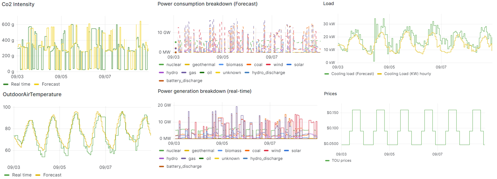

# Grid Signals

[Code & Installation Instructions](https://github.com/der-control-modules/grid-signals){ .md-button }

The Grid Signals agent (also referred to as the Grid Information agent) generates and publishes **grid service
signals** that the [Scheduler](scheduler.md) and [Real-Time Control Agent](rt-control.md) use to decide how to
operate the storage system. It currently produces:

* **Price signals**: time-of-use (TOU) price profiles, with helpers for ComEd and PJM market prices.
* **CO₂ signals**: carbon intensity and power generation breakdown, both real-time and as a 24-hour forecast, from
  the [Electricity Maps](https://www.electricitymaps.com/) API.

These signals, together with the outputs of the [Forecaster Agent](forecaster-agent.md), are stored by the VOLTTRON
historian and visualized in Grafana, as shown in [](#grid-signals-dashboard).

Figure: Grafana dashboard of grid signals and forecasts: real-time and forecast CO₂ intensity, power consumption and
generation breakdown, TOU prices, and the forecasted load and outdoor air temperature. {#grid-signals-dashboard}



## Behavior and published topics

On configuration the agent schedules its runs and publishes to topics derived from the configured `campus`:

| Signal               | Trigger                              | Topic                                                                                       |
|----------------------|--------------------------------------|---------------------------------------------------------------------------------------------|
| TOU price (per hour) | `run_dayahead_schedule`              | `devices/<campus>/grid_information/price/all` (point `tou`, cents)                          |
| 24-hour CO₂ forecast | `run_dayahead_schedule`              | `record/<campus>/grid_information/co2/forecast/{carbonIntensity,powerConsumptionBreakdown}` |
| Real-time CO₂        | `run_realtime_schedule` (if enabled) | `record/<campus>/grid_information/co2/real_time/{carbonIntensity,powerConsumptionBreakdown}` |

The price run builds a 24-hour profile, rotates it so that it starts at the current hour, and publishes one message
per upcoming hour. The CO₂ forecast run fetches the last 24 hours of Electricity Maps data and shifts the timestamps
forward 24 hours as a naive forecast.

## Configuration

The agent is configured through the VOLTTRON configuration store. Signal types are nested under
`type_of_grid_service_signals`, with a `price` block and/or a `co2` block.

| Parameter               | Description                                                                        |
|-------------------------|------------------------------------------------------------------------------------|
| `campus`                | Campus identifier used to build the publish topics.                                |
| `run_dayahead_schedule` | Cron expression for the day-ahead run (price profile and 24-hour CO₂ forecast).    |
| `run_realtime_schedule` | Cron expression for the real-time CO₂ run (only used when `co2.real-time` is true). |

### Price block

| Parameter              | Description                                                                          |
|------------------------|--------------------------------------------------------------------------------------|
| `type_of_price_signal` | Currently `TOU`.                                                                     |
| `type_of_tou_pricing`  | TOU variant, e.g. `standard`.                                                        |
| `TOU_pricing.interval` | Hour ranges per tier (`off-peak`, `mid-peak`, `on-peak`), as `[start, end)` pairs.   |
| `TOU_pricing.pricing`  | Price ($/kWh) for each tier.                                                         |

### CO₂ block

| Parameter                 | Description                                                                              |
|---------------------------|------------------------------------------------------------------------------------------|
| `real-time`               | If true, also publishes real-time CO₂ on `run_realtime_schedule`.                        |
| `method`                  | `API`.                                                                                   |
| `API_information.API_key` | Electricity Maps API token. Keep it out of version control.                              |
| `API_information.zone`    | Electricity Maps zone id (e.g. `US-NW-PACW`).                                            |

### Example

```json
{
  "campus": "PNNL",
  "run_dayahead_schedule": "0 0 * * *",
  "run_realtime_schedule": "0 * * * *",
  "type_of_grid_service_signals": {
    "price": {
      "type_of_price_signal": "TOU",
      "type_of_tou_pricing": "standard",
      "TOU_pricing": {
        "interval": {"off-peak": [[0, 7], [21, 23]], "mid-peak": [[7, 10], [18, 21]], "on-peak": [[10, 18]]},
        "pricing": {"off-peak": 0.04675, "mid-peak": 0.09083, "on-peak": 0.15925}
      }
    },
    "co2": {
      "real-time": true,
      "method": "API",
      "API_information": {"API_key": "<your_electricity_maps_api_key>", "zone": "US-NW-PACW"}
    }
  }
}
```

## Requirements

* Python >= 3.10
* VOLTTRON >= 10.0
* `pandas`, `numpy`, `python-dateutil`, `requests`

## Installation

Before installing, VOLTTRON should be installed and running with its virtual environment active.

```shell
git clone https://github.com/der-control-modules/grid-signals
vctl install ./grid-signals --tag grid-signals --start
```
