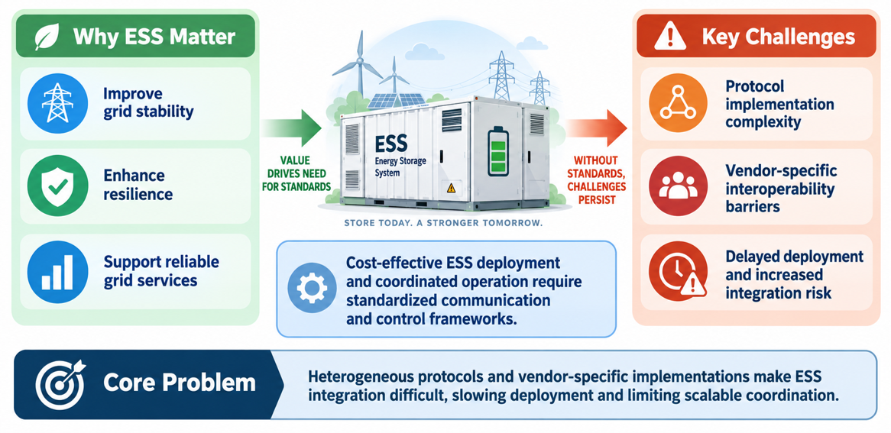
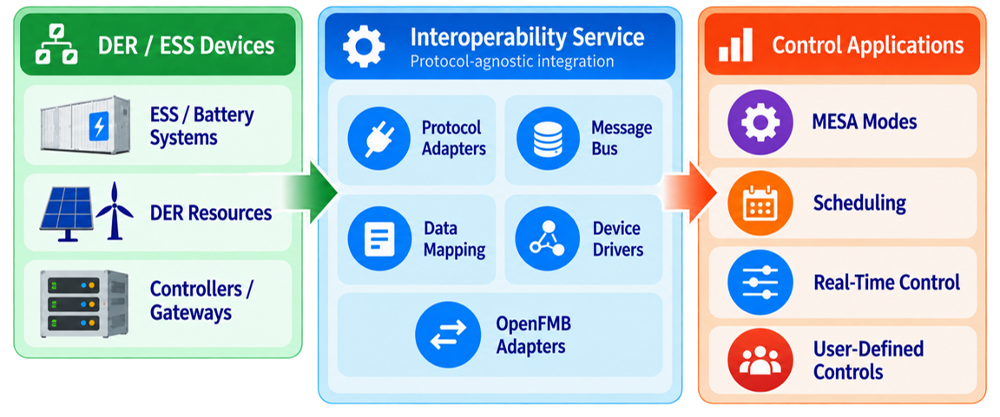

# Introduction

Energy storage systems (ESS) is the most capable resource, supporting grid stability, enhancing flexibility, and adding
new services to the electrical system. However, the integration of ESS can be challenging and costly due to evolving communication standards
and operating modes. In order to reduce integration complexity and avoid interoperability issues that delay seamless deployment,
this work provides an open-source interoperable communication and control framework for ESS.
This framework provides a protocol-agnostic interface for ESS by mapping the data models
of IEC 61850-7-420 to protocols according to IEEE 1547 standards. In addition, controls are developed based on
existing MESA modes and a control framework that includes scheduling and real-time control mechanisms
to provide grid services. This framework streamlines the integration of ESS by translating communication standards,
providing examples of complex control modes, and therefore reducing complexity, risk, and cost associated with full utilization of ESS capabilities across diverse vendors.

# Background

ESS improves energy efficiency, reduces electricity costs,
and improves the reliability of the grid. It can provide critical services like frequency regulation
and voltage control, helping maintain grid stability and prevent blackouts. As more distributed and intermittent
energy sources, such as photovoltaic (PV) and wind power, along with bidirectional components like electric
vehicles (EVs), are integrated into the grid, the role of ESS is expanding. Advanced control and optimization
algorithms are driving research into ESS management. For example, the financial advantages of peak shaving
and energy arbitrage for BTM ESS under demand charge tariffs, while other works examined ESS integration to
mitigate the short-term variability of renewable energy, further evaluated various energy storage technologies
for grid services.

Interoperability ensures that various energy storage systems from different manufacturers can communicate
and coordinate charging/discharging activities efficiently. Several communication protocols and standards
have been developed to address SunSpec Modbus, Distributed Network Protocol 3 (DNP3) and global standards like
IEC 61850 for power utility operation. IEEE 2030.5 supports communication in smart grids for energy resources
like ESS, while IEEE 1547 establishes standards for interconnection and interoperability with the grid,
addressing voltage regulation, frequency response, anti-islanding protection and grid support functions.
Successful ESS demonstration projects require seamless integration with other devices highlighting the need
for standardized communication protocols to address interoperability challenges.

# Problem Definition

Heterogeneous protocols and vendor-specific implementations make ESS integration difficult, slowing deployment
and limiting scalable coordination. As summarized in , the value that ESS provides to the grid
drives the need for standards, but without a standardized communication and control framework the challenges persist:

* High complexity and cost due to evolving communication standards and operating modes.
* Vendor-specific interoperability barriers that require custom integration for every device.
* Delayed ESS/DER deployment and increased integration risk.

Figure: Why ESS matter, and the key challenges that a standardized communication and control framework must address.
{#problem-definition}

# Proposed Solution

The framework described on this site is an open-source interoperable communication and control framework.
As shown in , it sits between DER/ESS devices and the control applications that operate them:

* **Interoperable control and communication infrastructure**: the [Interoperability Service](interoperability-service.md)
  provides a standard, protocol-agnostic interface to DER devices by mapping protocol-specific data models through a
  common model, using protocol adapters, device drivers, data mapping, and a message bus.
* **OpenFMB integration**: [message bus adapters](message-bus-adapter.md) connect the framework to OpenFMB systems
  over [NATS](nats.md) and [MQTT](mqtt.md); see [OpenFMB Integration](openfmb.md).
* **Applications**: the [Real-Time Control Agent](rt-control.md) implements [MESA modes](mesa-modes.md) and
  [novel PNNL-developed control functions](novel-real-time-control.md); the [Scheduler](scheduler.md) provides day-ahead
  dispatch; the [Grid Signals](grid-signals.md) and [Forecaster](forecaster-agent.md) agents supply price, CO₂, and load
  inputs; and [ES Control Integration](es-control-integration.md) shares the algorithms with the ES-Control simulation tool.

Figure: The proposed solution. The Interoperability Service provides protocol-agnostic integration between DER/ESS
devices and control applications. {#proposed-solution}

# User Guide

The services and agents described on this site comprise an interoperability framework to provide integration, control,
and optimization of energy storage systems within a grid environment. This framework is described on
[The Interoperability Framework](interoperability-framework.md) page.

Each component is additionally described on its own page, as follows:

| Component | Code |
|---|---|
| [Interoperability Service](interoperability-service.md) | [interoperability-service](https://github.com/der-control-modules/interoperability-service) |
| [Message Bus Adapters](message-bus-adapter.md) | [message-bus-adapter](https://github.com/der-control-modules/message-bus-adapter) |
| [MQTT Protocol Proxy](mqtt.md) | [lib-protocol-proxy-mqtt](https://github.com/der-control-modules/lib-protocol-proxy-mqtt) |
| [NATS Protocol Proxy](nats.md) | [lib-protocol-proxy-nats](https://github.com/der-control-modules/lib-protocol-proxy-nats) |
| [OpenFMB Integration](openfmb.md) | [openfmb_der](https://github.com/der-control-modules/openfmb_der) |
| [Real-Time Control Agent](rt-control.md) ([MESA Modes](mesa-modes.md), [Novel Real-Time Control](novel-real-time-control.md)) | [realtime-control-agent](https://github.com/der-control-modules/realtime-control-agent) |
| [Scheduler](scheduler.md) | [scheduler](https://github.com/der-control-modules/scheduler) |
| [ES Control Integration](es-control-integration.md) | [ctrl-eval-engine](https://github.com/der-control-modules/ctrl-eval-engine) |
| [Grid Signals](grid-signals.md) | [grid-signals](https://github.com/der-control-modules/grid-signals) |
| [Forecaster Agent](forecaster-agent.md) | [load-forecaster](https://github.com/der-control-modules/load-forecaster) |
| [der-control-fastlib Runtime](der-control-fastlib.md) | [der-control-fastlib](https://github.com/der-control-modules/der-control-fastlib) |

Links to code and installation instructions can also be found at the top of each component page.
A step-by-step guide to deploying the framework and applications on the der-control-fastlib runtime is
given under [Deployment](deployment.md).
