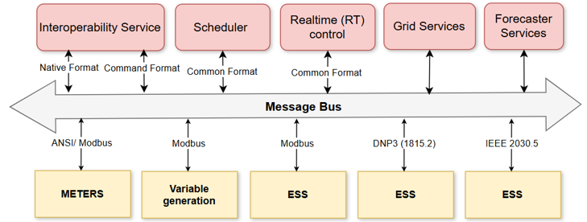
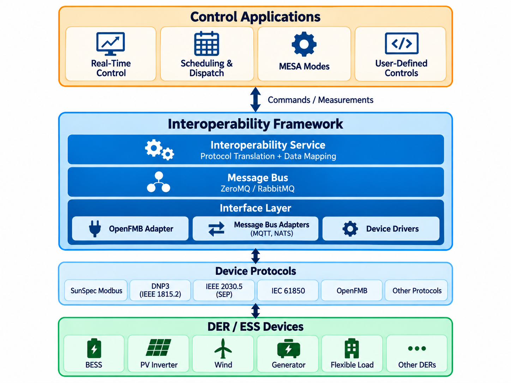
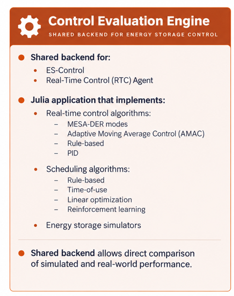

# The Interoperability Framework

The Interoperability Framework, as shown in  and described in
, provides a set of open-source services and VOLTTRON agents which
work together to enable seamless integration, control, and optimization of energy storage systems within a grid
environment, improving operational efficiency and grid stability. All components communicate via a message bus,
with the data flowing through the bus being stored in a database.
Visualization of the data is achieved through Grafana. Grafana is an open-source platform for monitoring,
visualizing, and analyzing metrics and log data from the various components.

At the center of the framework is the [Interoperability Service](interoperability-service.md), which translates the
native data models and protocols of field devices (SunSpec Modbus, IEEE 1815.2/DNP3, IEEE 2030.5, IEC 61850,
OpenFMB) into a common format consumed by the scheduler, real-time control, grid information, and forecaster
components.

!!! warning "Interoperability Agent deprecated"
    Earlier versions of this framework used a VOLTTRON [Interoperability Agent](interoperability.md) to perform
    the protocol mapping. The agent is deprecated and has been replaced by the Interoperability Service.

Figure: A suite of open-source services and agents for an interoperable framework. The Interoperability Service
translates native device formats into the common format used by the control components.
{#interop-framework-services-diagram}

## Architecture

The framework is organized in layers, as shown in . Control applications (real-time
control, scheduling and dispatch, MESA modes, and user-defined controls) exchange commands and measurements with the
Interoperability Framework. Within the framework, the Interoperability Service performs protocol translation and data
mapping, the message bus (ZeroMQ or RabbitMQ) carries messages between components, and an interface layer of OpenFMB
adapters, message bus adapters (MQTT, NATS), and device drivers connects to DER/ESS devices over their native
protocols.

Figure: Layered architecture of the Interoperability Framework. {#interop-framework-layers}

Table: Descriptions of framework components. {#interop-framework-components-table}

| Component                                                   | Description                                                                                                                                                                                                                                                                                                                                                                                                                                                                                                                                                                                                                                                                                                                                                                                                                                                                                                                                                                                                                                                                                                                  |
|-------------------------------------------------------------|------------------------------------------------------------------------------------------------------------------------------------------------------------------------------------------------------------------------------------------------------------------------------------------------------------------------------------------------------------------------------------------------------------------------------------------------------------------------------------------------------------------------------------------------------------------------------------------------------------------------------------------------------------------------------------------------------------------------------------------------------------------------------------------------------------------------------------------------------------------------------------------------------------------------------------------------------------------------------------------------------------------------------------------------------------------------------------------------------------------------------|
| [**Interoperability Service**](interoperability-service.md) | Provides a standard, protocol-agnostic interface to DER devices. Maps protocol-specific data models (SunSpec Modbus, IEEE 1815.2, IEEE 2030.5, IEC 61850-7-420, OpenFMB) once through a common model, using graph-based transformation pipelines to perform multi-stage conversions rather than maintaining direct mappings between every protocol pair. Decouples control applications from the underlying communication protocols. Replaces the deprecated [Interoperability Agent](interoperability.md).                                                                                                                                                                                                                                                                                                                                                                                                                                                                                                                                                                                                                  |
| **Message Bus Adapters**                                    | Connect the internal framework message bus with external OpenFMB message buses over [NATS](https://github.com/der-control-modules/lib-protocol-proxy-nats) and [MQTT](https://github.com/der-control-modules/lib-protocol-proxy-mqtt), via the [message-bus-adapter](https://github.com/der-control-modules/message-bus-adapter). See [OpenFMB](openfmb.md).                                                                                                                                                                                                                                                                                                                                                                                                                                                                                                                                                                                                                                                                                                                                                                 |
| [**Scheduler Agent**](scheduler.md)                         | Responsible for scheduling energy storage and grid operations using forecasted demand, generation, and pricing data. Integrates an optimization-based scheduler while remaining modular to support additional algorithmic approaches, ensuring efficient energy storage and usage based on real-time grid needs and energy price variations.                                                                                                                                                                                                                                                                                                                                                                                                                                                                                                                                                                                                                                                                                                                                                                                 |
| [**Real-Time Control (RT) Agent**](rt-control.md)           | Actuates controls on energy storage systems. Designed for adaptability and efficiency in controlling grid operations in real-time. User-defined novel algorithms can be implemented in Python or Julia. Several pre-defined control algorithms are provided, including several MESA modes:    - **Charge/Discharge Power**: Operates based on a set schedule or specific set point.   - **Active Power Response**: Controls peak limiting, load following, and generation following.   - **Automatic Generation Control (AGC)**: Follows utility signals to balance power supply and demand.   - **Active Power Limit**: Restricts the maximum and minimum power output levels.   - **Active Power Smoothing**: Provides moving average control for smoothing power output.   - **Frequency Watt Modes**: Frequency-Watt Modes include Vertex and Gradient modes, advanced strategies for managing power output based on grid frequency deviations. Vertex Mode utilizes a piecewise linear control curve, while Gradient Mode uses a continuous, proportional response to stabilize the grid smoothly. |
| **Grid Information Agent**                                  | Provides real-time and day-ahead data on CO₂ intensity, energy generation breakdown, and pricing information. Configurable to handle TOU pricing data for adjusting grid operations in response to market fluctuations.                                                                                                                                                                                                                                                                                                                                                                                                                                                                                                                                                                                                                                                                                                                                                                                                                                                                                                      |
| **Forecaster Agent**                                        | Utilizes historical data from the VOLTTRON historian agent and a load forecast model to predict future energy load and outdoor temperature conditions. Helps utilities anticipate grid needs and optimize the scheduling and operation of energy storage systems.                                                                                                                                                                                                                                                                                                                                                                                                                                                                                                                                                                                                                                                                                                                                                                                                                                                            |
| **Control Evaluation Engine**                               | Julia application that implements the real-time control and scheduling algorithms and energy storage simulators. Shared backend for the RT Control Agent and the web-based [ES-Control](https://es-control.pnnl.gov/) tool, allowing direct comparison of simulated and real-world performance. Code: [ctrl-eval-engine](https://github.com/der-control-modules/ctrl-eval-engine).                                                                                                                                                                                                                                                                                                                                                                                                                                                                                                                                                                                                                                                                                                                                             |

## Implemented Control Modes

The control components implement the following MESA modes and PNNL-developed control functions.
See [Real-Time Control Agent](rt-control.md) and [Scheduler](scheduler.md) for details.

| Category                  | Modes                                                                                                                       |
|---------------------------|-----------------------------------------------------------------------------------------------------------------------------|
| **Active power modes**    | Active Power Limiting, Charge/Discharge Storage, AGC, Active Power Smoothing, Frequency-Watt, Volt-Watt, Pricing Signal Mode |
| **Active power response** | Peak Limiting, Load Following, Generation Following                                                                          |
| **Reactive power modes**  | Fixed-VAR, Power Factor, Reactive Power Limit, Volt-VAR, Watt-VAR                                                            |
| **Emergency modes**       | Dynamic Reactive Current Support, Voltage Emergency, Frequency Emergency                                                     |
| **Scheduling modes**      | Optimization based, ML based                                                                                                 |

## Control Evaluation Engine

The Control Evaluation Engine, summarized in , is the shared backend for both the
[Real-Time Control Agent](rt-control.md) and the web-based [ES-Control](https://es-control.pnnl.gov/) energy storage
control tool. Because the same algorithm implementations run in simulation and on real hardware, the performance of a
control strategy on a simulated energy storage system can be compared directly against its real-world performance.

Figure: The Control Evaluation Engine provides a shared backend for energy storage control. {#control-eval-engine}

For more information and experimentation results, read the article:
[Interoperable Energy Storage Control and Communication Framework Development](
https://ieeexplore.ieee.org/abstract/document/10891219)
