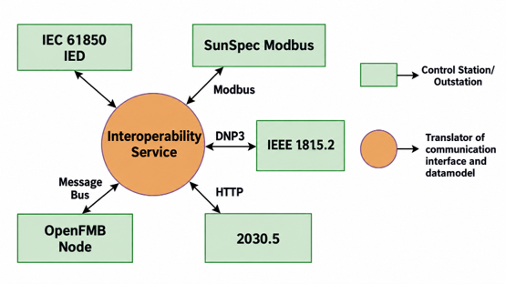
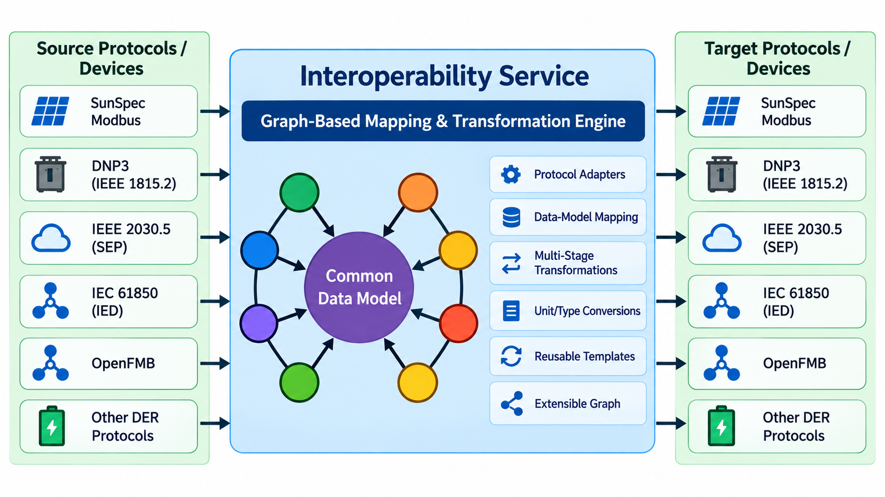

# Interoperability Service

[Code & Installation Instructions](https://github.com/der-control-modules/interoperability-service){ .md-button }

The Interoperability Service lets control applications address Distributed Energy Resource (DER) data by a stable,
protocol-neutral identifier and receive it in whatever data format they understand. It provides templates for
standards-based communication and reduces integration complexity:

* **Reduces vendor-specific integration effort and deployment risk.** Supports interoperability across protocols
  including SunSpec Modbus, IEEE 1815.2 (DNP3 / MESA-DER), IEEE 2030.5, IEC 61850-7-420, and OpenFMB.
* **Translates communication interfaces and data models** to enable seamless device-to-application interaction
  regardless of the native protocol of each device.
* **Enables protocol-agnostic control and reference implementations.** Control applications such as the
  [Real-Time Control Agent](rt-control.md) and [Scheduler](scheduler.md) are decoupled from the underlying
  communication protocols, ensuring reliable and consistent operation across multiple ESS and DER vendors.

It does this with two cooperating pieces: a **mapping engine** that resolves a Uniquely Addressable Identifier (UAI)
to the canonical resource that actually publishes the data, following aliases as needed, and a **transform registry**
that holds declarative field-mapping rules between data formats and finds a chain of transforms from the format a
resource is published in to the format a consumer asked for. Consumers call one RPC, `resolve`, and get back the
resource definition plus the transform needed to read it in their preferred format.

As illustrated in [](#interop-service-mapping), the service acts as a translator of communication interfaces and data
models between control stations or outstations that speak different protocols.

Figure: The Interoperability Service translates communication interfaces and data models between IEC 61850 IEDs,
SunSpec Modbus, IEEE 1815.2 (DNP3), IEEE 2030.5 (HTTP), and OpenFMB nodes on a message bus. {#interop-service-mapping}



## Graph- and Transform-Based Interoperability

Rather than maintaining a direct mapping between every pair of protocols, the service maps each protocol-specific
data model once onto a common data model, as shown in [](#interop-service-graph-transform). Transforms between data
formats are stored as edges in a directed graph keyed by format name. A conversion from one format to another is
found as the shortest path through this graph, so multi-stage transformations are composed automatically from reusable
steps. For example, with the bundled IEEE 1815.2 to IEC 61850 and IEC 61850 to SunSpec transforms registered, a
request for a DNP3 device's data in SunSpec form is served by chaining the two without any direct DNP3 to SunSpec
rule set. This approach:

* Extends interoperability using graph-based mappings and transformation pipelines.
* Expands mappings between protocol-specific and common data models.
* Enables multi-stage transformations rather than maintaining direct mappings between every protocol pair.
* Supports reusable transformation paths across SunSpec Modbus, IEEE 1815.2 / DNP3, IEEE 2030.5, OpenFMB, and other
  supported interfaces.
* Reduces protocol-specific custom integration.

Figure: Generalized graph- and transform-based interoperability. Source and target protocols are mapped once through a
common data model, and multi-stage transformations are derived from the transform graph.
{#interop-service-graph-transform}



## Concepts

### Uniquely Addressable Identifiers

A UAI is an ordered tuple of path segments, for example `("site1", "feeder2", "pv_inverter")`. Internally the
service stores all UAIs in a tree rooted at `uai`; each segment becomes a node. A UAI may be given as a tuple, a list,
or a JSON-encoded string of the tuple.

Resolution is **longest-prefix** by default. If `("site1", "feeder2", "pv_inverter", "W")` is requested and no node
exists for that full path, the engine walks up to `("site1", "feeder2", "pv_inverter")` and so on until it finds a
resource. Pass `strict=True` to require an exact match.

### Resources

A leaf in the UAI tree is a resource. There are two kinds:

| Type        | Fields                                                   | Meaning                                                                                                                                              |
|-------------|----------------------------------------------------------|------------------------------------------------------------------------------------------------------------------------------------------------------|
| `canonical` | `data_format`, `owner`, `publication_topic`, `rpc_topic` | The real source of the data. `publication_topic` is the message bus topic the data appears on; `rpc_topic` is where writes go.                       |
| `alias`     | `data_format`, `owner`, `references`                     | A name that points at another UAI (`references`). `data_format` is the format the alias presents itself in.                                          |

Aliases can chain. When an alias is resolved the engine follows `references` until it reaches a canonical resource.
If the caller did not name a target format, the alias's own `data_format` is used as the target, so an alias is a
convenient way to say "this device, but as seen through IEC 61850."

### Formats and transforms

A **transform** is a declarative rule set that converts a message in one `input_format` to one in an
`output_format`. Transforms are stored as edges in a directed graph keyed by format name. When a consumer asks for a
resource in a format other than the one it is published in, the registry finds the shortest path through the graph
and returns the ordered list of transform patterns along that path. If no path exists, an empty list is returned and a
warning is logged.

## Bundled transforms

The package ships with transform definitions between the IEC 61850-7-420, IEEE 1815.2 (MESA-DER), and SunSpec data
models. They are loaded automatically at start-up as configuration defaults, so a deployment only needs to supply
its device mappings. The format names used by the bundled files are:

| Format name      | Meaning                                                                    |
|------------------|----------------------------------------------------------------------------|
| `61850`          | IEC 61850-7-420 logical nodes and data objects (DGEN, DSTO, DECP, MMXU, ...) |
| `sunspec`        | SunSpec Modbus models, keyed by model number (`1`, `701`, `702`, `705`, ...) |
| `1815.2.inputs`  | IEEE 1815.2 (MESA-DER / DNP3) input points, grouped as `AI` and `BI`         |
| `1815.2.outputs` | IEEE 1815.2 output points, grouped as `AO` and `BO`                          |

| File                        | Direction                                                    |
|-----------------------------|--------------------------------------------------------------|
| `1815.2_to_61850.json`      | `1815.2.inputs` to `61850`, and `1815.2.outputs` to `61850`  |
| `61850_to_1815.2.json`      | `61850` to `1815.2.inputs`, and `61850` to `1815.2.outputs`  |
| `61850_to_sunspec.json`     | `61850` to `sunspec`                                         |
| `sunspec_to_61850.json`     | `sunspec` to `61850`                                         |
| `sunspec_61850_curves.json` | Curve-point mappings between SunSpec models 705 to 712 and the IEC 61850 DER curve nodes (DVVR, DWVR, DVWC, ride-through). Draft: uses a per-point placeholder the expression language does not yet support. |

The IEEE 1815.2 files are generated from the MESA-DER PICS specification. Anything supplied through the
configuration store is applied on top of these defaults, so a site can add its own formats or override individual
rules.

## Transform expression language

Each value in a transform `pattern` is a small expression that says where in the input message the output field
comes from and what functions to apply along the way. Patterns are parsed with pyparsing and compiled to convtools
pipelines, so they are evaluated as compiled Python rather than interpreted per message.

```
transform[<path segment>, <path segment>, ...](<function>(<args>), <function>(<args>), ...)
```

* The bracketed segments are the path into the input message. Segments may be dictionary keys or list indices. Bare
  identifiers may contain letters, digits, `_`, and `.`; a segment with any other character, such as `RegClas[1]`,
  must be quoted with single or double quotes. Unquoted digits are treated as integers.
* If the brackets are omitted, the path of output keys leading to the expression is used as the input path.
* The parenthesised functions are applied in order to the value found at that path. An empty pair of parentheses
  copies the value unchanged.
* Function arguments may be integers, quoted strings, bare identifiers, dotted paths (`phsA.mag`), or nested calls.

Patterns may be **nested**. A value that is an object is a group, and the output contains the same group structure.
This is how the bundled files organise fields under IEC 61850 logical nodes or SunSpec model numbers. A value of
`null` marks an output field with no known source; it is skipped.

Source fields are **optional**. If the input message does not contain an expression's source path, that field is
left out of the output rather than raising an error, and a group whose fields are all absent is left out too. A
source that is present with a value of `null` is copied through as `null`. This lets a transform written for a full
device message be applied to a partial update.

An excerpt from the bundled IEC 61850 to SunSpec transform shows the nested style:

```json
{
  "input_format": "61850",
  "output_format": "sunspec",
  "pattern": {
    "1": {
      "Mn": "transform[LPHD, PhyNam, vendor]()",
      "Md": "transform[LPHD, PhyNam, model]()",
      "SN": "transform[LPHD, PhyNam, serNum]()"
    },
    "702": {
      "WMaxRtg": "transform[DGEN, WMaxRtg]()",
      "VAMaxRtg": "transform[DGEN, VAMaxRtg]()",
      "VNomRtg": "transform[DECP, VRef]()",
      "WChaRteMaxRtg": "transform[DSTO, WChaUnPFRtg]()"
    }
  }
}
```

And an example that applies functions, reading a nested IEC 61850 style message, copying the total power through and
averaging the three phase voltage magnitudes while skipping any that are missing:

```json
{
  "W":   "transform[DECP, MMXU, TotW]()",
  "LNV": "transform[DECP, MMXU, PNV](mean(phsA.mag, phsB.mag, phsC.mag))"
}
```

Table: Transform functions {#transform-functions}

| Function                      | Effect                                                                                                                              |
|-------------------------------|-------------------------------------------------------------------------------------------------------------------------------------|
| `multiple(n)`                 | Multiply by `n`. Has an inverse.                                                                                                    |
| `add(n)`                      | Add `n`. Has an inverse.                                                                                                            |
| `scale_int(n)`                | Multiply by `n` and cast to `int`. Has an inverse.                                                                                  |
| `scale_decimal_int_signed(n)` | Scale a decimal-encoded signed register (PM800 power factor style). Has an inverse.                                                 |
| `cast_value(type_name)`       | Cast to `bool`, `str`, `int`, `float`, `list`, `tuple`, or `dict`. Boolean parsing accepts common truthy and falsy strings.        |
| `mean(path, ...)`             | Average of several dotted-path fields of the current value, ignoring missing or `null` fields.                                      |

Functions that define an inverse are intended to support automatic generation of reverse transforms in the future.

## Interface

The service runs under the VIP identity `platform.presentation` and exposes the following interface on the message bus.

| Method / topic                                             | Type   | Returns                | Description                                                                                                                                                                                                                              |
|------------------------------------------------------------|--------|------------------------|------------------------------------------------------------------------------------------------------------------------------------------------------------------------------------------------------------------------------------------|
| `resolve(uai, as_format=None, strict=False)`               | RPC    | dict                   | Resolves a UAI to its canonical resource. When `as_format` is given, the result also includes `target_format` and `transform`, the ordered list of transform patterns from the resource's `data_format` to `as_format`. Returns `{}` if nothing canonical is found. |
| `lookup_transform(input_format, output_format)`            | RPC    | list of pattern dicts  | The transform chain between two formats, or `[]` if there is no path or a format has never been registered.                                                                                                                                |
| `register_transform(input_format, output_format, pattern)` | RPC    | none                   | Adds a transform edge to the registry at runtime.                                                                                                                                                                                        |
| `mapper/update`                                            | PubSub | none                   | Publish a list of mapping objects (same structure as the `mappings` configuration below) to add resources to the UAI tree at runtime.                                                                                                     |

## Configuration

The service reads a single `config` entry from the configuration store with two top-level lists, `mappings` and
`transforms`. Because the bundled transforms are loaded as defaults, a typical configuration contains only mappings:

```json
{
  "mappings": [
    {
      "uai": ["site1", "feeder2", "pv_inverter"],
      "resource_type": "canonical",
      "resource": {
        "data_format": "sunspec",
        "owner": "platform.driver",
        "publication_topic": "devices/site1/feeder2/pv_inverter/all",
        "rpc_topic": "devices/site1/feeder2/pv_inverter"
      }
    },
    {
      "uai": ["site1", "pv_61850"],
      "resource_type": "alias",
      "resource": {
        "data_format": "61850",
        "owner": "platform.driver",
        "references": ["site1", "feeder2", "pv_inverter"]
      }
    }
  ],
  "transforms": []
}
```

In this example, an agent that resolves the alias `["site1", "pv_61850"]` receives the canonical SunSpec resource for
the inverter together with the bundled `sunspec` to `61850` transform, without needing to know which protocol the
device speaks.

Each entry in `mappings`:

| Key             | Required | Type           | Description                                                                |
|-----------------|----------|----------------|----------------------------------------------------------------------------|
| `uai`           | yes      | list or string | The identifier being defined. A string is parsed as a JSON-encoded tuple.  |
| `resource_type` | yes      | string         | `canonical` (or `canon`) or `alias` (or `aliased`).                        |
| `resource`      | yes      | object         | The resource fields listed in the Resources table above.                   |

Each entry in `transforms`:

| Key             | Required | Type   | Description                                                                |
|-----------------|----------|--------|----------------------------------------------------------------------------|
| `input_format`  | yes      | string | Format name of the incoming message.                                       |
| `output_format` | yes      | string | Format name of the produced message.                                       |
| `pattern`       | yes      | object | Output field name to transform expression, possibly nested.                |

Store the configuration with:

```shell
vctl config store platform.presentation config path/to/config.json
```

## Consuming a resource from another agent

`interoperability.resource.ResourceData` is a client-side helper used by the [Message Bus Adapter](message-bus-adapter.md)
and available to any agent. It resolves a UAI through the service, compiles the returned transform, subscribes to the
canonical publication topic, and delivers transformed payloads to a callback under the caller's own local topic:

```python
from interoperability.resource import ResourceData

def on_data(peer, sender, bus, topic, headers, message):
    ...  # message is already in the requested format

resource = ResourceData.lookup(self, ("site1", "feeder2", "pv_inverter"))
if resource:
    resource.subscribe(on_data)
```

`lookup` accepts a tuple, a list, or a delimited string (default delimiter `/`).

## OpenFMB data models

The package includes pydantic models for each OpenFMB module (breaker, capacitor bank, circuit segment service,
environment, ESS, EVSE, generation, interconnection, load, meter, recloser, regulator, reserve, resource, solar,
switch, and common types), together with keyword-only profile builders for constructing complete OpenFMB profiles and
sample generators for solar reading and status profiles. These models are the groundwork for an `openfmb` data format
in the transform registry and are used with the [Message Bus Adapters](message-bus-adapter.md) for
[OpenFMB Integration](openfmb.md). They are not yet wired into the bundled transforms.

## Integration with Control Applications and OpenFMB

Publish/subscribe messaging provides normalized device data to control applications, which consume the published
data structures and issue control commands back through the framework, enabling coordinated actuation of multiple
heterogeneous DER/ESS devices. Message bus adapters connect the framework bus to OpenFMB buses over NATS and MQTT,
while device drivers provide direct point-to-point communication with controllers and devices. See the
[OpenFMB Integration](openfmb.md) page for the integration architecture.

## Status and known limitations

The service is at an early stage. Current limitations:

* **Array and curve mappings are not supported.** There is no way to express "for each element of a list" in a
  pattern, so the SunSpec curve-point mappings are drafts.
* **Transform weighting.** All transform edges have weight 0, so path selection is by hop count only. Weighting by
  lossiness is a planned improvement.
* **Inverse transforms** are attached to several functions but reverse pipelines are not yet generated automatically.
* **No default mappings ship with the package**, so UAIs must be supplied through the configuration store or the
  `mapper/update` topic.

## Requirements

* Python >= 3.10
* Modular Eclipse VOLTTRON (`volttron-core` >= 2.0.0rc30). The agent also falls back to the monolithic
  `volttron.platform` imports if `volttron-core` is not installed.
* Runtime libraries, installed with the package: `convtools`, `networkx`, `pydantic` 2, `pyparsing`, `treelib`

## Installation

Before installing, VOLTTRON should be installed and running and its virtual environment should be active.
Information on how to install the VOLTTRON platform can be found
[here](https://github.com/eclipse-volttron/volttron-core).

```shell
git clone https://github.com/der-control-modules/interoperability-service
vctl install ./interoperability-service --vip-identity platform.presentation --tag interop --start
vctl config store platform.presentation config path/to/config.json
vctl status
```

Other agents look the service up by the identity `platform.presentation`, so keep that identity unless the callers are
also changed. For deployment on the der-control-fastlib runtime, see [Deployment](deployment.md).
