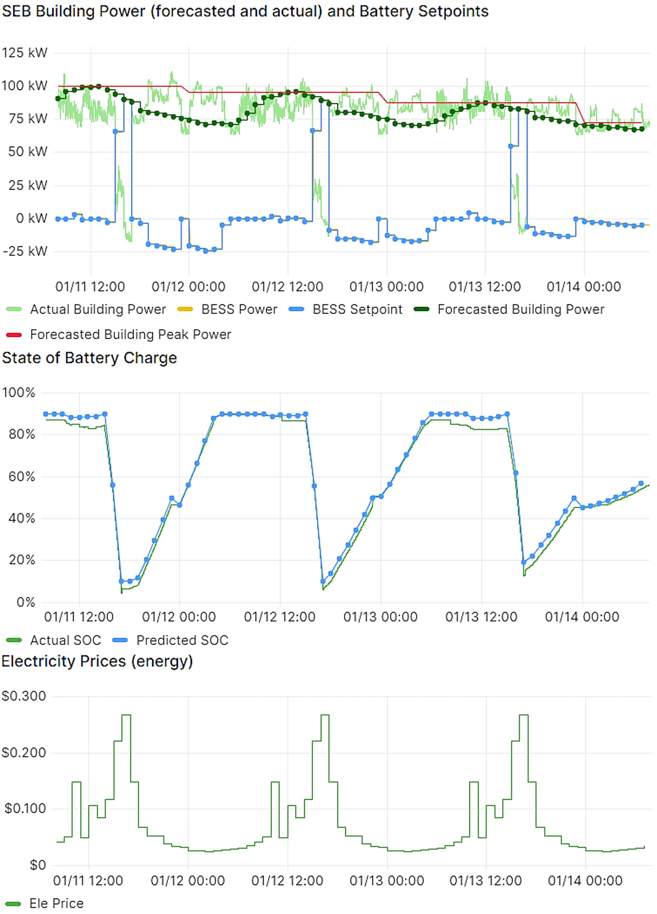
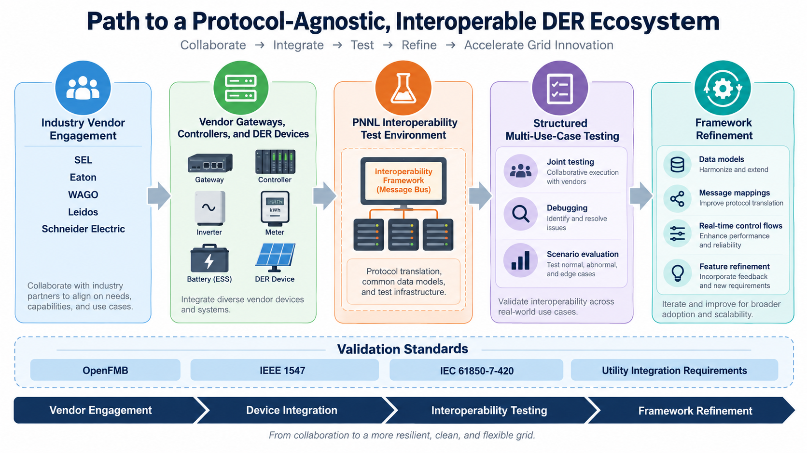
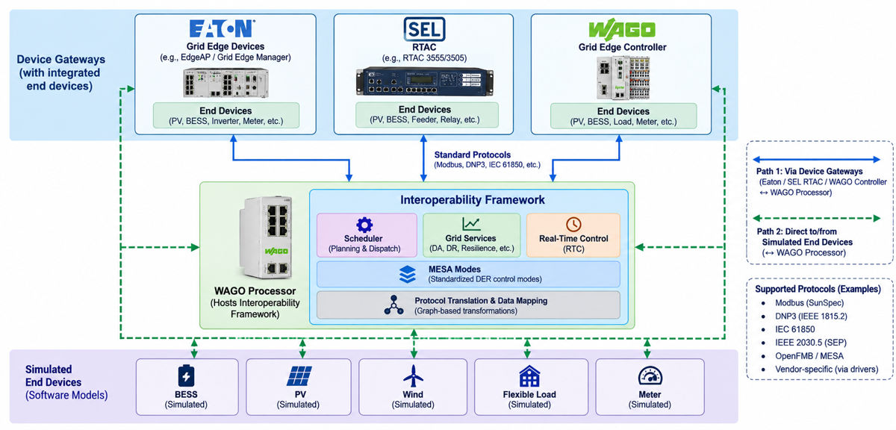

# Test Cases

The communication and control framework has been tested on the PNNL campus using a 125kW/250kWh BESS and a building
with a 150kW peak load. Tests involving energy arbitrage, demand charge reduction and MESA charge/ discharge modes
are further discussed in
[Interoperable Energy Storage Control and Communication Framework Development](https://ieeexplore.ieee.org/document/10891219).

# Experimentation Results with VOLTTRON

In the VOLTTRON platform, the Battery Energy Storage Systems (BESS) within the grid is integrated using modular agents for efficiency and cost-effectiveness. Multiple agents such as Forecaster, Grid Information, Real-time (MESA charge/Discharge Power mode) and Scheduler are the data source for the system with the help of external data sources include CO2 intensity, energy generation breakdown and electricity prices from APIs to indicate BESS operations.

## Key Features

| Feature                  | Description                                                                                   |
|--------------------------|-----------------------------------------------------------------------------------------------|
| **Forecast Inputs**      | Day-ahead forecasts of CO2 intensity, energy generation mix, and electricity prices.          |
| **Optimization Process** | Provides outdoor temperature and load forecasts for scheduling BESS operations.               |
| **Optimization Objectives** | Focuses on minimizing electricity expenses using forecasted price signals for a 24-hour operation plan. |
| **Constraints**          | Ensures BESS power limits and State of Charge (SoC) boundaries are maintained.                |
| **Power Management**     | Utilizes price signals for efficient battery charging and discharging.                        |
| **Modular Integration**  | VOLTTRON agents collaborate to provide dynamic and efficient energy management.               |

Figure: MESA Charge/Discharge mode implementation, showing the Scheduler agent's 24-hour battery operation plan based
on price signals to minimize costs and reduce peak power. {#mesa-charge-discharge}

This implementation highlights how predictive modeling and real-time data enhance energy management and grid service delivery through VOLTTRON, demonstrating adaptive, efficient and cost-effective operations.

# Industry Engagement and Ongoing Testing

To validate the interoperability framework against real vendor equipment, PNNL is engaging key industry vendors,
including SEL, Eaton, WAGO, Leidos, and Schneider Electric, and has established a dedicated interoperability test
environment at PNNL. The test setup, shown in , hosts the interoperability framework on a WAGO
processor and connects it to:

* **Device gateways with integrated end devices**: Eaton grid edge devices (e.g., EdgeAP / Grid Edge Manager),
  SEL RTAC (e.g., RTAC 3555/3505), and WAGO grid edge controllers, each with PV, BESS, inverter, meter, feeder, relay,
  or load end devices behind them, communicating over standard protocols (Modbus, DNP3, IEC 61850).
* **Simulated end devices**: software models of BESS, PV, wind, flexible load, and meters, reached directly from the
  framework.

Supported protocols in the test environment include Modbus (SunSpec), DNP3 (IEEE 1815.2), IEC 61850, IEEE 2030.5 (SEP),
OpenFMB/MESA, and vendor-specific protocols via drivers. The goals of this effort are to:

* Validate the interoperability framework using real vendor devices, including gateways, controllers, and DER
  interfaces from Eaton, SEL, and WAGO.
* Demonstrate interoperability across multiple protocols and data models, including OpenFMB, IEEE 1547 /
  IEC 61850-7-420, and utility integration interfaces.
* Conduct structured and repeatable interoperability testing across multiple use cases, using vendor feedback to
  refine data models, message mappings, framework capabilities, and real-time control workflows.

Figure: Path to a protocol-agnostic, interoperable DER ecosystem: vendor engagement, device integration,
interoperability testing, and framework refinement. {#industry-engagement}

Figure: Ongoing interoperability test setup at PNNL. Path 1 reaches end devices through vendor gateways (Eaton,
SEL RTAC, WAGO controller); Path 2 connects the framework directly to simulated end devices. {#testing-setup}

