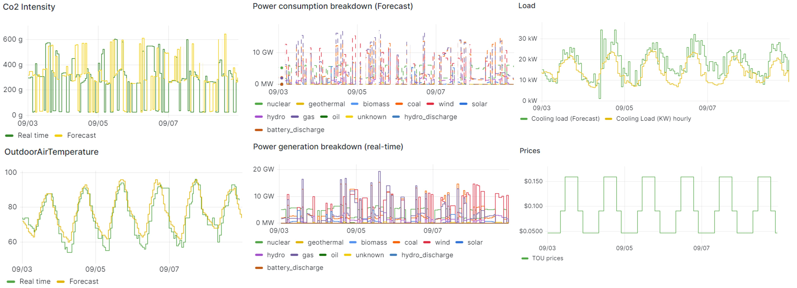
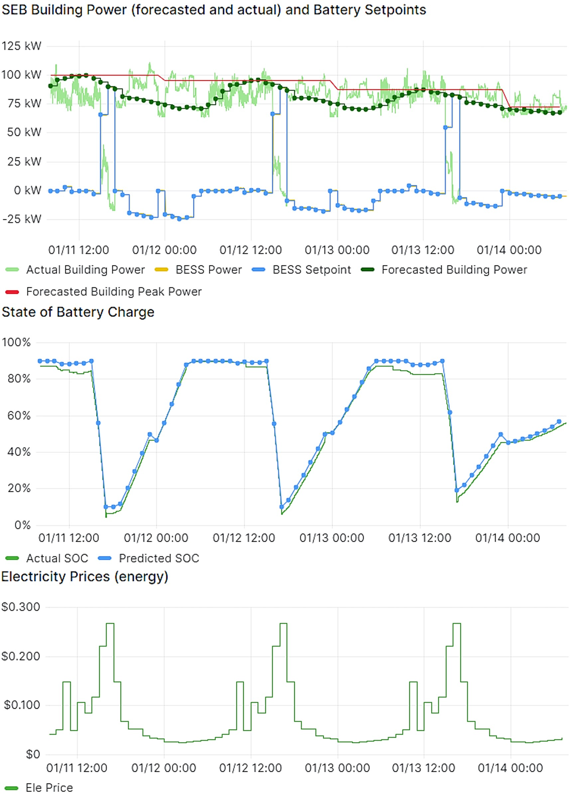

# Test Cases

The communication and control framework has been tested on the PNNL campus using a 125kW/250kWh BESS and a building
with a 150kW peak load. Tests involving energy arbitrage, demand charge reduction and MESA charge/ discharge modes
are further discussed in
[Interoperable Energy Storage Control and Communication Framework Development](https://ieeexplore.ieee.org/document/10891219).

Figure: Output from the Grid Information and Forecaster agents, showing day-ahead CO2 intensity, generation breakdown, price data, TOU configuration, outdoor temperature, and load forecasts.

# Experimentation Results with VOLTTRON 

In the VOLTTRON platform, the Battery Energy Storage Systems (BESS) within the grid is integrated using modulaer agents for efficiency and cost-effectiveness. Multiple agents such as Forecaster, Grid Information, Real-time (MESA charge/Discharge Power mode) and Scheduler are the data source for the system with the help of external data sources include CO2 intensity, energy generation breakdown and electricity prices from APIs to indicate BESS operations. 

## Key Features

| Feature                  | Description                                                                                   |
|--------------------------|-----------------------------------------------------------------------------------------------|
| **Forecast Inputs**      | Day-ahead forecasts of CO2 intensity, energy generation mix, and electricity prices.          |
| **Optimization Process** | Provides outdoor temperature and load forecasts for scheduling BESS operations.               |
| **Optimization Objectives** | Focuses on minimizing electricity expenses using forecasted price signals for a 24-hour operation plan. |
| **Constraints**          | Ensures BESS power limits and State of Charge (SoC) boundaries are maintained.                |
| **Power Management**     | Utilizes price signals for efficient battery charging and discharging.                        |
| **Modular Integration**  | VOLTTRON agents collaborate to provide dynamic and efficient energy management.   

Figure : MESA Charge/Discharge mode implementation, showing the Scheduler agent's 24-hour battery operation plan based on price signals to minimize costs and reduce peak power.
           |

This implementation highlights how predictive modeling and real-time data enhance energy management and grid service delivery through VOLTTRON, demonstrating adaptive, efficient and cost-effective operations. 

